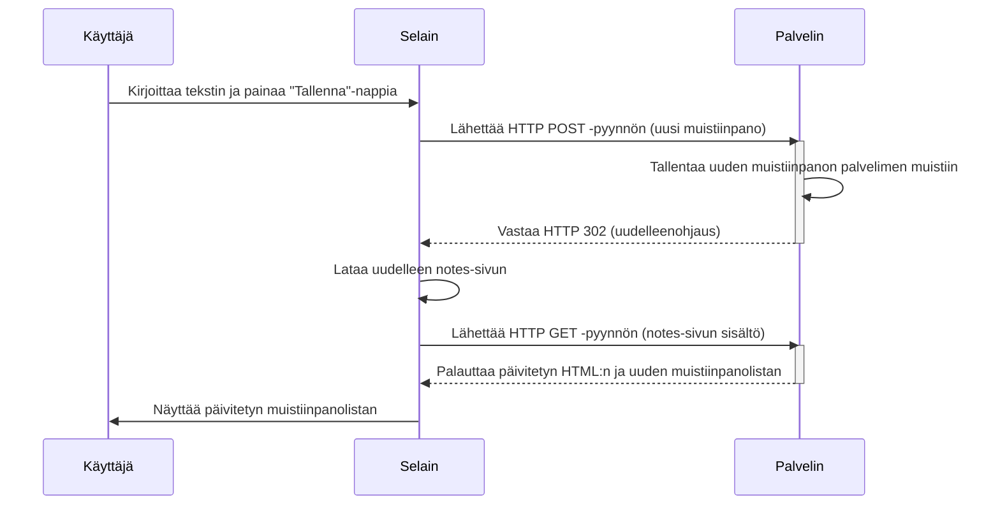

```mermaid
sequenceDiagram
    participant User as Käyttäjä
    participant Browser as Selain
    participant Server as Palvelin

    User->>Browser: Kirjoittaa tekstin ja painaa "Tallenna"-nappia
    Browser->>Server: Lähettää HTTP POST -pyynnön (uusi muistiinpano)
    activate Server
    Server->>Server: Tallentaa uuden muistiinpanon palvelimen muistiin
    Server-->>Browser: Vastaa HTTP 302 (uudelleenohjaus)
    deactivate Server
    Browser->>Browser: Lataa uudelleen notes-sivun
    Browser->>Server: Lähettää HTTP GET -pyynnön (notes-sivun sisältö)
    activate Server
    Server-->>Browser: Palauttaa päivitetyn HTML:n ja uuden muistiinpanolistan
    deactivate Server
    Browser->>User: Näyttää päivitetyn muistiinpanolistan
```
