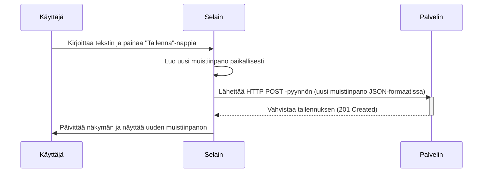

```mermaid
sequenceDiagram
    participant User as Käyttäjä
    participant Browser as Selain
    participant Server as Palvelin

    User->>Browser: Kirjoittaa tekstin ja painaa "Tallenna"-nappia
    Browser->>Browser: Luo uusi muistiinpano paikallisesti
    Browser->>Server: Lähettää HTTP POST -pyynnön (uusi muistiinpano JSON-formaatissa)
    activate Server
    Server-->>Browser: Vahvistaa tallennuksen (201 Created)
    deactivate Server
    Browser->>User: Päivittää näkymän ja näyttää uuden muistiinpanon
```
