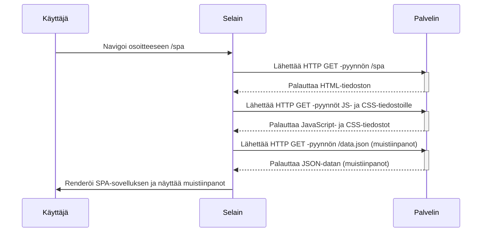

```mermaid
sequenceDiagram
    participant User as Käyttäjä
    participant Browser as Selain
    participant Server as Palvelin

    User->>Browser: Navigoi osoitteeseen /spa
    Browser->>Server: Lähettää HTTP GET -pyynnön /spa
    activate Server
    Server-->>Browser: Palauttaa HTML-tiedoston
    deactivate Server
    Browser->>Server: Lähettää HTTP GET -pyynnöt JS- ja CSS-tiedostoille
    activate Server
    Server-->>Browser: Palauttaa JavaScript- ja CSS-tiedostot
    deactivate Server
    Browser->>Server: Lähettää HTTP GET -pyynnön /data.json (muistiinpanot)
    activate Server
    Server-->>Browser: Palauttaa JSON-datan (muistiinpanot)
    deactivate Server
    Browser->>User: Renderöi SPA-sovelluksen ja näyttää muistiinpanot
```
